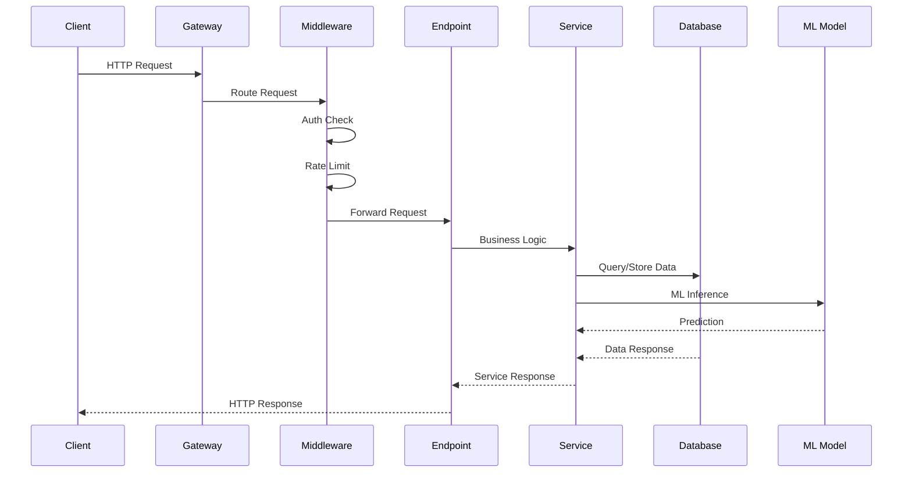
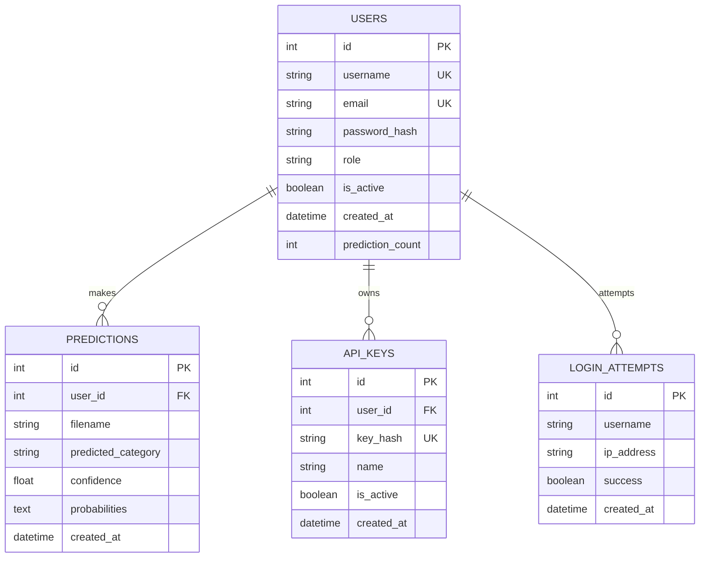

# 🚀 FastAPI Application Architecture

## System Overview

```mermaid
graph TB
    subgraph "External Clients"
        WEB[Web Frontend]
        MOBILE[Mobile App] 
        STREAMLIT[Streamlit App]
        CLI[CLI Tools]
    end

    subgraph "API Gateway"
        LB[Load Balancer]
        GATEWAY[API Gateway]
    end

    subgraph "FastAPI Application"
        subgraph "Middleware Stack"
            AUTH_MW[Auth Middleware]
            CORS_MW[CORS Middleware]
            RATE_MW[Rate Limiting]
            SEC_MW[Security Headers]
        end

        subgraph "API Endpoints"
            AUTH_EP[/auth/* endpoints]
            PRED_EP[/predict/* endpoints]
            ADMIN_EP[/admin/* endpoints]
            HEALTH_EP[/health endpoint]
        end

        subgraph "Service Layer"
            USER_SVC[User Service]
            PRED_SVC[Prediction Service]
        end

        subgraph "Core Components"
            CONFIG[Configuration]
            SECURITY[Security Utils]
            DATABASE[Database Layer]
            LOGGING[Logging Config]
        end
    end

    subgraph "External Services"
        OPENAI[OpenAI API]
        ANTHROPIC[Anthropic API]
        TF_MODEL[TensorFlow Model]
    end

    subgraph "Data Storage"
        SQLITE[(SQLite DB)]
        FILES[File Storage]
        MODEL_FILE[ML Model File]
    end

    %% Connections
    WEB --> LB
    MOBILE --> LB
    STREAMLIT --> LB
    CLI --> LB
    
    LB --> GATEWAY
    GATEWAY --> AUTH_MW
    AUTH_MW --> CORS_MW
    CORS_MW --> RATE_MW
    RATE_MW --> SEC_MW
    
    SEC_MW --> AUTH_EP
    SEC_MW --> PRED_EP
    SEC_MW --> ADMIN_EP
    SEC_MW --> HEALTH_EP
    
    AUTH_EP --> USER_SVC
    PRED_EP --> PRED_SVC
    ADMIN_EP --> USER_SVC
    ADMIN_EP --> PRED_SVC
    
    USER_SVC --> SECURITY
    USER_SVC --> DATABASE
    PRED_SVC --> TF_MODEL
    PRED_SVC --> DATABASE
    
    DATABASE --> SQLITE
    PRED_SVC --> FILES
    PRED_SVC --> MODEL_FILE
    PRED_SVC --> OPENAI
    PRED_SVC --> ANTHROPIC
    
    CONFIG --> SECURITY
    CONFIG --> DATABASE
    CONFIG --> LOGGING
```

## Request Flow



## Database Schema



## File Structure

```
api/
├── core/
│   ├── config.py              # Configuration management
│   ├── database.py            # Database connection & models
│   ├── security.py            # JWT & password handling
│   ├── middleware.py          # Custom middleware
│   ├── models.py              # Pydantic models
│   └── logging_config.py      # Logging setup
├── services/
│   ├── user_service.py        # User management logic
│   └── prediction_service.py  # ML prediction logic
├── main.py                    # FastAPI app entry point
├── modele_cnn_transfer.h5     # Trained ML model
├── projet3_api.db             # SQLite database
├── Dockerfile                 # Container configuration
└── requirements.txt           # Python dependencies
```

## Key Features

### Authentication & Security
- JWT-based authentication
- Role-based access control (user/admin)
- API key management
- Rate limiting (100 requests/hour)
- Password hashing with bcrypt

### ML Prediction Pipeline
- TensorFlow CNN model
- Image classification for game categories
- Multiple image format support
- Batch prediction capabilities
- Integration with OpenAI/Anthropic APIs

### Production Ready
- Docker containerization
- Environment-based configuration
- Comprehensive error handling
- Health check endpoints
- Structured logging
- API documentation with Swagger/OpenAPI