# 🎮 Projet_3 API Architecture Diagram

## System Architecture Overview

## Data Flow Diagram

```mermaid
sequenceDiagram
    participant Client as 🌐 Client
    participant Gateway as 🛡️ API Gateway
    participant Auth as 🔐 Auth Middleware
    participant RateLimit as ⏱️ Rate Limiter
    participant Service as 🎯 Service Layer
    participant ML as 🤖 ML Model
    participant DB as 💾 Database
    participant External as 🌍 External APIs

    %% Authentication Flow
    Client->>Gateway: POST /auth/login
    Gateway->>RateLimit: Check rate limit
    RateLimit->>Auth: Validate credentials
    Auth->>DB: Query user
    DB-->>Auth: User data
    Auth-->>Client: JWT Token

    %% Prediction Flow
    Client->>Gateway: POST /predict/image
    Note over Client,Gateway: With JWT token
    Gateway->>RateLimit: Check rate limit
    RateLimit->>Auth: Verify JWT
    Auth->>Service: Forward request
    Service->>ML: Load & predict
    ML-->>Service: Prediction result
    Service->>DB: Store prediction
    Service->>External: Generate description (optional)
    External-->>Service: Generated text
    Service-->>Client: Prediction response

    %% Admin Flow
    Client->>Gateway: GET /admin/stats
    Note over Client,Gateway: With admin JWT
    Gateway->>RateLimit: Check rate limit
    RateLimit->>Auth: Verify admin role
    Auth->>Service: Forward request
    Service->>DB: Query statistics
    DB-->>Service: Stats data
    Service-->>Client: Admin response
```

## Database Schema

## Service Dependencies

```mermaid
graph LR
    subgraph "🎯 Main Services"
        MAIN[main.py]
        PRED[PredictionService]
        USER[UserService]
    end

    subgraph "🔧 Core Dependencies"
        CONFIG[config.py]
        SECURITY[security.py]
        DB[database.py]
        MIDDLEWARE[middleware.py]
        LOGGING[logging_config.py]
    end

    subgraph "📦 External Dependencies"
        FASTAPI[FastAPI]
        SQLALCHEMY[SQLAlchemy]
        JWT[python-jose]
        BCRYPT[passlib/bcrypt]
        TENSORFLOW[TensorFlow]
        PIL[Pillow]
        OPENAI[OpenAI]
        ANTHROPIC[Anthropic]
    end

    MAIN --> PRED
    MAIN --> USER
    MAIN --> CONFIG
    MAIN --> SECURITY
    MAIN --> MIDDLEWARE
    MAIN --> LOGGING

    PRED --> TENSORFLOW
    PRED --> PIL
    PRED --> OPENAI
    PRED --> ANTHROPIC
    PRED --> DB

    USER --> JWT
    USER --> BCRYPT
    USER --> DB

    DB --> SQLALCHEMY
    SECURITY --> JWT
    SECURITY --> BCRYPT

    MAIN --> FASTAPI
```

## Deployment Architecture

```mermaid
graph TB
    subgraph "🐳 Docker Container"
        subgraph "🚀 API Container"
            API[FastAPI App<br/>Port 8080]
            MODEL[ML Model<br/>9.5MB]
            DB_FILE[SQLite DB<br/>60KB]
        end
    end

    subgraph "📊 Monitoring Stack"
        PROMETHEUS[Prometheus<br/>Metrics Collection]
        GRAFANA[Grafana<br/>Visualization]
    end

    subgraph "🌐 Network"
        NGINX[Nginx<br/>Reverse Proxy]
        SSL[SSL/TLS<br/>Termination]
    end

    subgraph "💾 Persistent Storage"
        VOLUME[Data Volume<br/>uploads/ predictions/ logs/]
    end

    NGINX --> SSL
    SSL --> API
    API --> MODEL
    API --> DB_FILE
    API --> VOLUME
    API --> PROMETHEUS
    PROMETHEUS --> GRAFANA

    classDef containerStyle fill:#e3f2fd,stroke:#1565c0,stroke-width:2px
    classDef monitoringStyle fill:#f3e5f5,stroke:#7b1fa2,stroke-width:2px
    classDef networkStyle fill:#e8f5e8,stroke:#388e3c,stroke-width:2px
    classDef storageStyle fill:#fff3e0,stroke:#f57c00,stroke-width:2px

    class API,MODEL,DB_FILE containerStyle
    class PROMETHEUS,GRAFANA monitoringStyle
    class NGINX,SSL networkStyle
    class VOLUME storageStyle
```

## Security Architecture

## Key Features Summary

### 🔐 **Authentication & Authorization**
- JWT-based authentication with refresh tokens
- Role-based access control (user/admin)
- API key management for programmatic access
- Secure password hashing with bcrypt

### 🎯 **ML Prediction Pipeline**
- TensorFlow CNN model for image classification
- Support for multiple image formats (JPEG, PNG, WebP)
- Batch prediction capabilities
- Integration with OpenAI/Anthropic for text generation

### 🛡️ **Security Features**
- Rate limiting (100 requests/hour per client)
- CORS protection with allowed origins
- Security headers (X-Content-Type-Options, X-Frame-Options, X-XSS-Protection)
- Input validation and sanitization

### 📊 **Monitoring & Observability**
- Structured logging with different levels
- Health check endpoints
- Prometheus metrics integration
- Audit logging for security events

### 🚀 **Production Ready**
- Docker containerization
- Environment-based configuration
- Database connection pooling
- Error handling and recovery
- Comprehensive API documentation

This architecture demonstrates a well-designed, production-ready API with proper separation of concerns, security measures, and scalability considerations.
