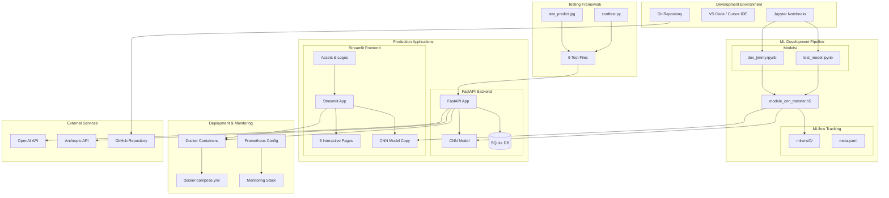
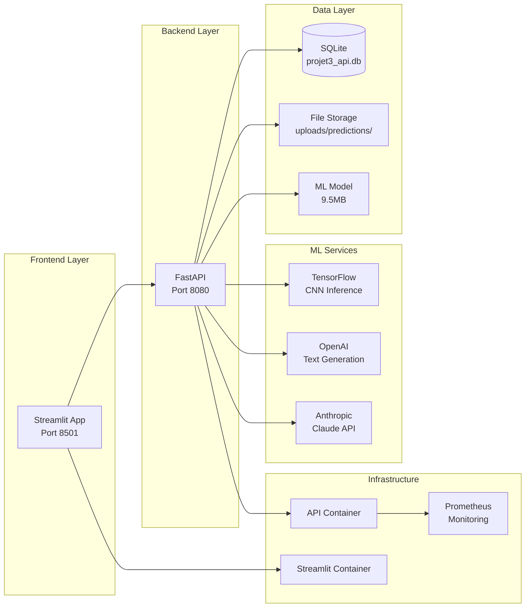
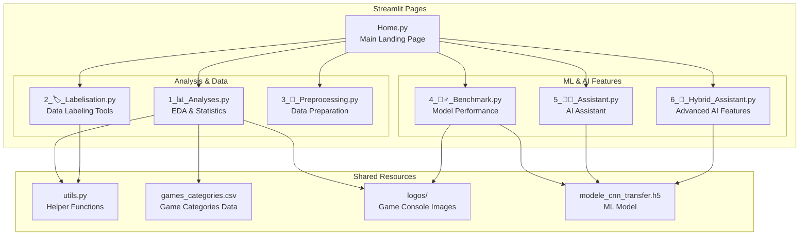
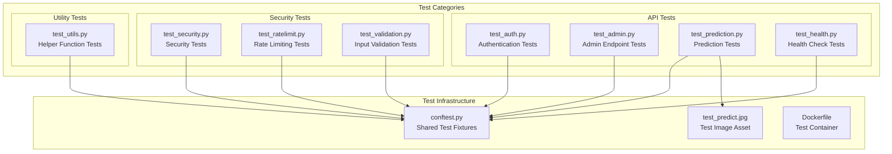

# 🎮 Projet_3 - Complete System Architecture

## System Overview



## Application Stack



## Streamlit Application Structure



## Testing Architecture



## File Structure Overview

```
PROJET_3/
├── api/                          # Backend FastAPI Application
│   ├── core/                     # Core utilities & configuration
│   │   ├── config.py             # App configuration
│   │   ├── database.py           # Database models & connection
│   │   ├── security.py           # Authentication & security
│   │   ├── middleware.py         # Custom middleware
│   │   ├── models.py             # Pydantic models
│   │   └── logging_config.py     # Logging configuration
│   ├── services/                 # Business logic layer
│   │   ├── user_service.py       # User management
│   │   └── prediction_service.py # ML prediction logic
│   ├── main.py                   # FastAPI app entry point
│   ├── modele_cnn_transfer.h5    # Trained CNN model (9.5MB)
│   ├── projet3_api.db            # SQLite database
│   ├── Dockerfile                # API container config
│   └── requirements.txt          # Python dependencies
├── Streamlit/                    # Frontend Streamlit Application
│   ├── pages/                    # Multi-page application
│   │   ├── 1_📊_Analyses.py      # Data analysis & visualization
│   │   ├── 2_🏷️_Labelisation.py  # Data labeling interface
│   │   ├── 3_🔣_Preprocessing.py # Data preprocessing tools
│   │   ├── 4_🕵️‍♂️_Benchmark.py    # Model performance metrics
│   │   ├── 5_👩‍💻_Assistant.py     # AI assistant interface
│   │   └── 6_🤖_Hybrid_Assistant.py # Advanced AI features
│   ├── logos/                    # Game console & UI assets
│   ├── Home.py                   # Main streamlit page
│   ├── utils.py                  # Helper functions
│   ├── games_categories.csv      # Game categories dataset
│   ├── modele_cnn_transfer.h5    # Model copy for Streamlit
│   ├── Dockerfile                # Streamlit container config
│   ├── requirements.txt          # Python dependencies
│   └── README.md                 # Streamlit documentation
├── Models/                       # ML Development & Research
│   ├── dev_jimmy.ipynb           # Main development notebook
│   └── test_model.ipynb          # Model testing notebook
├── Test/                         # Comprehensive test suite
│   ├── test_auth.py              # Authentication tests
│   ├── test_admin.py             # Admin functionality tests
│   ├── test_prediction.py        # ML prediction tests
│   ├── test_health.py            # Health check tests
│   ├── test_security.py          # Security tests
│   ├── test_ratelimit.py         # Rate limiting tests
│   ├── test_validation.py        # Input validation tests
│   ├── test_utils.py             # Utility function tests
│   ├── test_predict.jpg          # Test image for ML tests
│   ├── conftest.py               # Shared test fixtures
│   ├── Dockerfile                # Test container config
│   └── requirements.txt          # Test dependencies
├── data/                         # Data storage
│   └── projet3_api.db            # Database backup/copy
├── mlruns/                       # MLflow experiment tracking
│   └── 0/                        # Experiment run data
│       └── meta.yaml             # MLflow metadata
├── monitoring/                   # Monitoring & observability
│   └── prometheus.yml            # Prometheus configuration
├── docker-compose.yml            # Multi-container orchestration
├── projet3_api.db                # Main SQLite database
├── api_architecture_diagram.md   # API architecture documentation
└── README.md                     # Main project documentation
```

## Technology Stack

### Backend (FastAPI)
- **Framework**: FastAPI with Uvicorn
- **Database**: SQLite with SQLAlchemy ORM
- **Authentication**: JWT with python-jose
- **ML Framework**: TensorFlow for CNN inference
- **AI APIs**: OpenAI GPT & Anthropic Claude
- **Testing**: pytest with comprehensive test coverage

### Frontend (Streamlit)
- **Framework**: Streamlit multi-page application
- **Data Visualization**: Plotly, Matplotlib, Seaborn
- **Image Processing**: PIL, OpenCV
- **ML Integration**: Direct TensorFlow model loading
- **UI Components**: Custom Streamlit components

### Infrastructure & Deployment
- **Containerization**: Docker with multi-stage builds
- **Orchestration**: Docker Compose
- **Monitoring**: Prometheus metrics collection
- **Development**: Jupyter notebooks for ML research
- **Version Control**: Git with GitHub integration

### Security & Production Features
- **Authentication**: JWT-based with role management
- **Rate Limiting**: 100 requests/hour per client
- **Security Headers**: CORS, XSS protection, content type validation
- **Input Validation**: Comprehensive request validation
- **Error Handling**: Structured error responses
- **Logging**: Structured logging with different levels
- **Health Checks**: Application health monitoring endpoints

